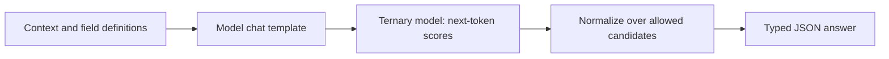

# Bev

**Ternary weights. One-token decisions. Typed answers.**

[](https://github.com/Reza2kn/Bev/releases)
[](https://huggingface.co/Reza2kn/Bev)
[](LICENSE)
[](licenses/MODEL-APACHE-2.0.txt)

Bev runs [Jevfire](https://github.com/kikoncuo/jevfire)-style decision scoring on [Prism ML's Ternary-Bonsai-2-27B](https://huggingface.co/prism-ml/Ternary-Bonsai-2-27B-gguf). Give it context and a finite set of choices; it scores every candidate, selects an answer, and returns structured JSON through a local HTTP API.

**Bev is an inference package, not a newly trained model.** The 7.21 GB GGUF is the original Prism file, redistributed byte-for-byte with its license and attribution. Bev adds the serving integration, selected-token scoring extension, typed API, and evaluation tools. No training, LoRA, or additional quantization was performed.

## At a glance

| Capability | Details |
|---|---|
| Decision types | Boolean, enum, Choice, Noul (`P(true)`), and ordered Score |
| Options | 2–255 candidates per field, validated with the loaded tokenizer |
| Method | One next-token scoring step per field; JSON assembled by the API |
| Model file | **7,206,168,928 bytes**, PQ2_0 ternary weights |
| Measured GPU use | About **8,504 MiB** for the serving process on an RTX 5080 Laptop GPU |
| Validated setup | Linux x86_64, NVIDIA GPU, pinned Prism CUDA 12.8 runtime |
| Persian benchmark | **95.42% Choice · 95.00% Noul · 87.50% Score** |

Memory is an observed process snapshot, not a minimum or peak-memory guarantee. Two inference slots provide 16,384 tokens per field by default. See [installation requirements](docs/INSTALL.md) and [benchmark conditions](docs/BENCHMARKS.md).

## Quick start

On a supported Linux GPU host with the [prerequisites](docs/INSTALL.md):

```sh
git clone --branch v0.1.1 https://github.com/Reza2kn/Bev.git
cd Bev
bash scripts/install.sh
bash scripts/start-services.sh
```

The installer verifies the pinned model and runtime downloads, builds the small native extension, and installs the Python API. The API listens on `127.0.0.1:18781`; interactive documentation is at [localhost:18781/docs](http://127.0.0.1:18781/docs).

```sh
curl --fail-with-body http://127.0.0.1:18781/v1/decisions \
  -H 'Content-Type: application/json' \
  --data-binary @examples/support-request.json
```

The example asks for a support queue. Its `parsed_json` result is:

```json
{"route": "billing"}
```

The full response also includes candidate probabilities, raw log probabilities, token IDs, and timing. [API documentation](docs/API.md) covers Python usage, all three SystemOne primitives, validation, and errors. To stop the managed services, run `bash scripts/stop-services.sh`.

The default runtime directory is `${XDG_DATA_HOME:-$HOME/.local/share}/bev`; set `BEV_ROOT` to choose another location. Weights are also available from [Hugging Face](https://huggingface.co/Reza2kn/Bev). This release requires the pinned **Prism fork** of llama.cpp; a generic GGUF loader is not sufficient.

## How it works



Bev maps each allowed answer to a distinct single-token label, preserving the original option identities and descriptions. The native [scoring patch](patches/README.md) exposes requested raw log probabilities normalized over the full vocabulary. Python then normalizes those scores over the candidates and constructs the result.

Choice returns the winning option. Noul returns the probability assigned to true. Score returns the probability-weighted position in the ordered rubric. Fields are evaluated independently; related decisions need a combined enum or explicit sequential requests. See [architecture and guarantees](docs/ARCHITECTURE.md).

## Measured results

The full [Jev Persian Benchmark](https://github.com/ArmanJR/Jev-Persian-Benchmark) used its original dataset, batches and scorer. All **624/624 answers** were valid across **106/106 completed requests**, with no model mismatches.

| Main test | Bev v0.1.1 | Published Jev 1.13.0 |
|---|---:|---:|
| Choice: exact option | **229/240 · 95.42%** | 239/240 · 99.58% |
| Noul: yes/no | **152/160 · 95.00%** | 159/160 · 99.38% |
| Score: within ±0.5 levels | **70/80 · 87.50%** | 76/80 · 95.00% |

Jev values are the benchmark author's [published reference](https://github.com/ArmanJR/Jev-Persian-Benchmark/blob/ac218d96630da9d9cc08fd897868c4d3c7048b0d/README.md#performance), not a new Jev run. Bev's median request latency was **2.136 seconds**, with six questions in main/repeat batches. This is not a matched-hardware speed comparison.

An earlier general diagnostic had weaker results on some tasks, including **7/12 MMLU** and **2/10 SimpleBench**. The [complete evaluation report](docs/BENCHMARKS.md) includes both runs, category results, numerical errors, provenance, and limitations. The Persian dataset is synthetic; these figures do not establish general reliability or Jev parity.

## Documentation

- [Install and operate](docs/INSTALL.md): dependencies, configuration, start/stop, and troubleshooting.
- [API reference](docs/API.md): requests, responses, primitives, and SDK compatibility.
- [Architecture](docs/ARCHITECTURE.md): scoring, runtime patch, capacity, and failure behavior.
- [Benchmarks](docs/BENCHMARKS.md): full measurements and comparison boundaries.
- [Reproduce the Persian evaluation](docs/REPRODUCE.md): frozen data, native scorer, and source attestation.
- [Model and runtime manifest](model-manifest.json): revisions, sizes, and SHA-256 values.
- [Release notes](release-notes.md) and [third-party notices](THIRD_PARTY_NOTICES.md).

## Scope and attribution

Candidate probabilities are relative preferences, not calibrated confidence in correctness. One-token scoring can miss tasks requiring multi-step reasoning; it can also be confidently wrong. `min_probability` is an optional abstention heuristic, not a reliability guarantee. The API binds to loopback by default and has no built-in public authentication.

Jevfire supplies the decision-scoring method and prompt; Prism ML supplies the ternary model and runtime; Qwen supplies the base model. The benchmark authors supply the evaluation protocols. Bev's integration and documentation were developed with OpenAI Codex assistance. Code is **MIT**; model weights remain **Apache-2.0**. See [complete attribution](THIRD_PARTY_NOTICES.md). This is an independent project.
